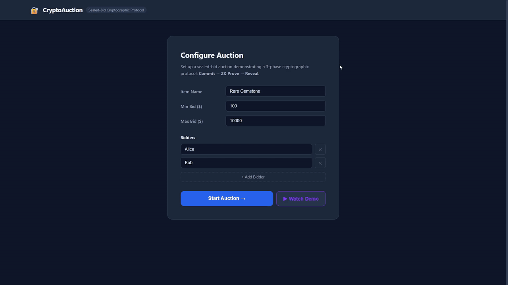

# CryptoAuction — Cryptographic Sealed-Bid Auction

[](https://github.com/erihhh6/crypto-auction/actions/workflows/ci.yml)
[](https://www.python.org/)
[](https://opensource.org/licenses/MIT)

A web application (Flask + vanilla JS) demonstrating a complete 3-phase sealed-bid
auction with applied cryptography: **Commit → ZK Prove → Reveal**.

> Built as a portfolio project to demonstrate applied cryptography concepts
> using only Python's standard library (`hashlib`, `os`, `struct`) and Flask.

---

## Demo



---

## What This Demonstrates

| Property | Mechanism | Guarantee |
|---|---|---|
| **Hiding** | SHA-256 commitment `C = SHA256(bid ‖ r)` | Auctioneer cannot learn bids before reveal |
| **Binding** | Collision resistance of SHA-256 | Bidders cannot change their bid after committing |
| **Soundness** | ZK range proof (Sigma + Fiat-Shamir) | Bids provably within `[min, max]` without disclosure |
| **Verifiability** | Commitment opening at reveal | Anyone can audit the final result |

---

## Security Model

**Honest-but-curious (semi-honest)**: the auctioneer follows the protocol but tries
to learn bids before the reveal phase. The construction prevents this:

```
Phase 1 — COMMIT:   auctioneer sees only C = SHA256(bid ‖ r)
Phase 2 — ZK PROVE: auctioneer knows bid ∈ [min, max] without seeing bid
Phase 3 — REVEAL:   auctioneer verifies SHA256(bid ‖ r) == C
```

Bidders are also honest-but-curious among themselves — they see each other's
commitments but not the underlying bid values until phase 3.

---

## Protocol

```
PHASE 1 — COMMIT
  Bidder i chooses bid_i and randomness r_i (32 random bytes)
  Computes   C_i = SHA256(bid_i_bytes ‖ r_i)
  Sends C_i → auctioneer stores it (bid_i, r_i remain private)

PHASE 2 — ZK VALIDATE
  Bidder i proves that bid_i ∈ [min_bid, max_bid]
  using a Sigma protocol with Fiat-Shamir transform (NIZK)
  without revealing bid_i
  Auctioneer verifies proof

PHASE 3 — REVEAL
  Bidder i reveals (bid_i, r_i)
  Auctioneer verifies: SHA256(bid_i ‖ r_i) == C_i
  Winner = argmax(verified bid_i)
```

---

## How to Run

```bash
pip install flask
python app.py
# Open http://localhost:5000
```

Or test the crypto modules independently:

```bash
python crypto/commitment.py   # commitment demo
python crypto/zkp.py          # ZK range proof demo
python crypto/auction.py      # full 3-bidder simulation
```

Run the test suite:

```bash
python -m unittest discover -s tests -v
```

---

## Project Structure

```
crypto-auction/
├── .github/
│   └── workflows/
│       └── ci.yml            # GitHub Actions CI
├── crypto/
│   ├── __init__.py
│   ├── commitment.py         # SHA-256 commitment scheme
│   ├── zkp.py                # ZK range proof (Sigma + Fiat-Shamir)
│   └── auction.py            # State machine + auction logic
├── docs/
│   └── demo.gif              # Demo GIF (shown in README)
├── static/
│   ├── app.js                # Frontend SPA (vanilla JS)
│   └── style.css             # Dark theme CSS
├── templates/
│   └── index.html            # Single page, 3-panel layout
├── tests/
│   ├── test_commitment.py    # 13 commitment tests
│   ├── test_zkp.py           # 18 ZK proof tests
│   └── test_auction.py       # 22 state machine tests
├── app.py                    # Flask app — all REST routes
└── requirements.txt          # flask only
```

---

## Cryptographic Primitives

| Primitive | Implementation | Purpose |
|---|---|---|
| Commitment | `SHA-256(bid_bytes ‖ randomness)` | Hiding + Binding |
| ZK Range Proof | Sigma protocol + Fiat-Shamir transform | Validity without disclosure |
| Challenge | `SHA-256(commitment ‖ announcement)` | Non-interactive (NIZK) |
| Reveal | Commitment opening | Auditability |

### Commitment Scheme

```
C = SHA256( struct.pack('>Q', bid) + os.urandom(32) )
```

- **Hiding**: SHA-256 is one-way; C reveals nothing about bid.
- **Binding**: SHA-256 is collision-resistant; bidder cannot find `(bid', r')` with the same C.

### ZK Range Proof

The range `[min, max]` is decomposed into two non-negativity proofs:

- `low_val  = bid - min  ≥ 0`
- `high_val = max - bid  ≥ 0`

Each uses a fresh commitment to the gap value, a Fiat-Shamir challenge
`e = SHA256(C_original ‖ C_gap)`, and a response `z = r_gap + e * r_original`.

The verifier checks:
1. Challenges are correctly re-derived (Fiat-Shamir consistency).
2. Responses are non-negative (witnesses to non-negative gap values).

---

## Limitations (Intentional for Demo)

- **Randomness server-side**: In production, clients generate `randomness_hex`
  locally in the browser and compute the commitment client-side. The server
  never sees it. Here the server generates and returns it once for simplicity.
- **Simplified ZK proof**: A Sigma-protocol construction, not a full
  Bulletproof or Groth16 SNARK. Suitable for demo; not production-grade.
- **Single-server model**: Production would use MPC for the auctioneer role.
- **In-memory state**: No database; a server restart resets the auction.

---

## References

- Commitment Schemes: Goldreich, *Foundations of Cryptography*, Vol. 1
- Sigma Protocols: Cramer, Damgård & Schoenmakers, *Proofs of Partial Knowledge* (1994)
- Fiat-Shamir Transform: Fiat & Shamir, *How to Prove Yourself* (1986)
- Sealed-Bid Auctions: Brandt, *How to Obtain Full Privacy in Auctions* (2006)
